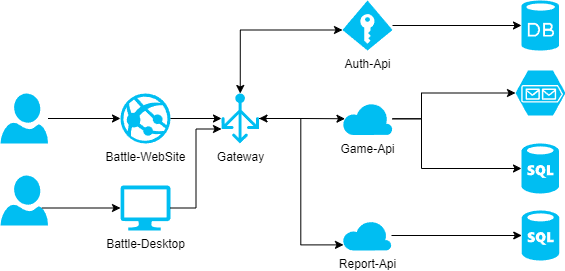

# space battle

Список сервисов:
- Battle-WebSite - UI Сайт игры, которые выступает контроллером для играка, отрисовывает игру и посылает команды на бек апи
- Battle-desktop - UI Приложение игры, выполняет ту же роль что и Battle-WebSite, только работает на локальном компьютере
- Gateway - API Маршрутизатор, доступный из внешней  сети, так же выступает в роли Service Discovery для всех сервисов
- Auth-Api - Сервис авторизации, генерирует токены для пользоваетелей, работает со своей БД, где хранит пользователей и рефреш токены
- Game-Api - Сервис игры, выполняет все команды игр, использует Брокер сообщения для последовательного хранения команд, в БД хранит состояние игр
- Report-Api - Сервис отчетности, хранит в БД плоские отчеты по прошедшим играм, содержит информацию по будущим играм и рейтинг игроков

Пользователи имеют возможно подклюиться к игре через десктопное приложение или веб-сайт(UI). Все запросы проходят через Gateway, который проверяет токены через Auth-Api. Все команды касательно игры выполняются в сервисе Game-Api, он в свою очередь сначала публикует команды в брокер сообщений, а потом последовательно для каждой игры их забирает и выполняет.Так же UI позволяет отобразить статистику и рейтинг, которые получает из сервиса Report-Api. 

Проблемные места:
1. Gateway - возможно бальшая нагрузка, т.к. все запросы будут проходить через него. Есть возможно увеличить колличество реплик  без последвствий, т.к. он не хранит никакое состояние.
2. Game-Api - сложные команды, могут долго выполняться и пропускная способность упадет. Так же есть возможность горизонтально масштабировать, т.к. все сообщения регистрируется в брокер, значит реплики смогут паралельно с ним работать без проблем дубляции этих команд.

Чаще всего будет менятся Game-Api, т.к. там много бизнес логики касательно игрового процесса. В дальнейшем возможно потребуется выделить отдельные контексты и разделить на отдельные сервисы.